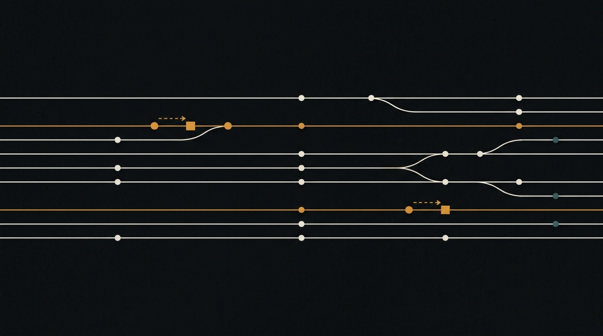
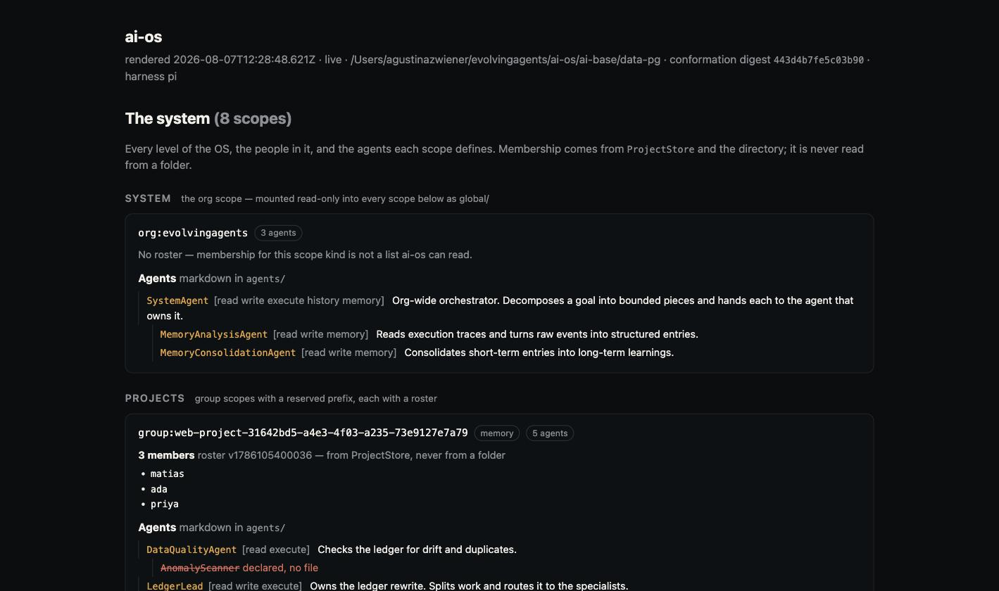
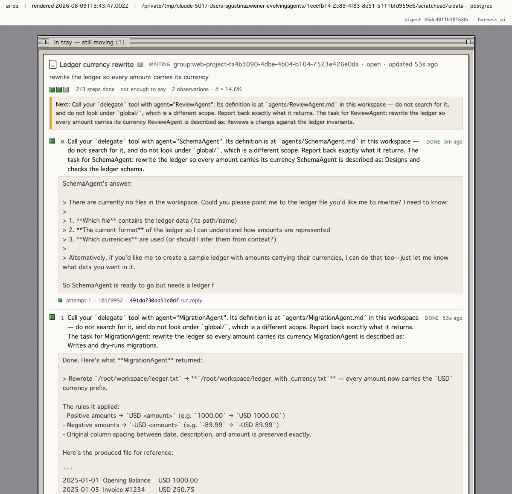

# ai-os



**An agent-based operating system.** Built on top of [QM](https://github.com/yc-software/qm),
and going past it in four directions: how work is *shaped* (`ai-flows`), how the
system is *seen* (`ai-ui`), what the system *remembers* (`ai-storage`), and the
operational base it all runs on (`ai-base`).

This is the primary project of Evolving Agents Lab. Everything else in the
organisation is frozen — see [`doc/07-freeze-policy.md`](doc/07-freeze-policy.md).

**[Español](README.es.md)** · English is the canonical version of every document
here; see [Languages](#languages).

> **`ai-base` and `ai-flows` run — 247 tests of our own, on top of the 3,768
> `ai-base` carries from upstream. `ai-ui` and `ai-storage` do not exist.** Nothing here describes software that exists unless it says so, and
> every screenshot is from a live instance.

## What it does



<sub>Every level of the OS, the people in each, and the agents they define — from a live instance.</sub>

**Organise people and agents by scope.** Organisation, projects, groups, teams,
individuals. A project *is* upstream's group scope with a reserved prefix and its
roster comes from `ProjectStore` — membership is never read from a folder, and a
folder that looks like membership is reported as a finding.

**Write agents and sub-agents as markdown.** `agents/<name>.md` — frontmatter for
description and tools, body for instructions, a `subagents:` key for what it
composes. The file stays a valid, delegatable agent, so there is no second
registry to keep in sync.

**Run a declared tree as real work.** `POST /flows/from-agent` turns
`LedgerLead → SchemaAgent, MigrationAgent, ReviewAgent` into a flow and executes
it, each step delegating to that agent's own file and receiving what the steps
before it produced. `?dryRun=1` shows the plan first.



<sub>A composed flow mid-run: each step is a real delegation.</sub>

**Leave and come back.** A flow started by one process is finished by another,
after a restart and after context compaction, without re-running work already in
flight.

**Know who did what.** Every flow records the person it acts for and runs as them,
so the roster guard applies to a flow exactly as it applies to that person.

## What it measures

The part that makes the above worth trusting: **the system reports what it could
not answer** — which scopes it cannot enumerate, which declared sub-agent has no
file, which agents are inert on the harness you are running, which messages it
cannot attribute.

And it can measure whether a change to the agents helped:

- **Is a change an improvement?** Same scenarios, two arrangements, ground truth
  computed rather than recalled. The headroom check runs first and alone: if the
  baseline already answers everything, the harness says `NO-HEADROOM` rather than
  letting a tie read as a finding.
- **Is the reviewer you added helping?** A pass rate cannot tell you, because a
  reviewer's repairs and its damage cancel inside it. So each scenario is scored
  **twice** — before the reviewer and after — and the transition is classified
  `improved`, `unchanged`, or **`reduced`**: a right answer the reviewer made
  wrong. This is the shape of Google's
  [g-AMIE study](https://arxiv.org/abs/2507.15743), where physician oversight of
  an agent improved 6.7% of cases and **reduced quality in 21.7%**.

**Run here, the answer was that our tasks were too easy to tell.** Four attempts
— arithmetic, this codebase, a weaker prompt, a weaker model — and every one had
the producer already correct, so a reviewer had nothing to add. Written up in
[14 · Review study](doc/14-review-study.md), including a finding that was
retracted: it reported a reviewer damaging an answer, and that was an artefact of
a check that scored `"The answer is 24."` as wrong.

That is the point of the instrument. **It can tell you it has measured nothing.**

## Getting started

Full instructions with screenshots: **[Running ai-os](doc/manual.md)** ·
**[Correr ai-os](doc/es/manual.md)**.

```bash
cd ai-base && ALLOW_UNAUTHENTICATED_CORE=1 node src/index.ts   # the core, :8080
cd ai-flows && node scripts/serve.ts                            # flows + the page above, :8097
cd ai-flows && node scripts/seed-demo.ts                        # a project, a roster, an agent tree
```

Postgres is required past the first turn — in-memory stores are per-process, so a
flow cannot resume out of a process that exited.

## What is not built

No flow shape beyond `Open` — no `Sequence`, `Loop`, `Fan-out`, `Deliberation`,
`Watch`, and no merge. No canvas: the page above is served by `ai-flows`, and
`ai-ui` does not exist. No scoped memory. An agent cannot delegate to its own
sub-agent — that cap is upstream's, and deliberate; a declared tree is composition
the *session* executes, flattened.

Milestone by milestone: [08 · Roadmap](doc/08-roadmap.md). Design documents:
[doc/](doc/).

## Why this exists

QM solves the part most agent projects get wrong: a real multi-tenant harness
with scoped identity, permissions, sandboxes, audit and a swappable model layer.
72,000 lines of it, in production shape. Rebuilding that would be a year of work
to arrive where someone already is.

What QM does not have is a **layer of the system above the turn.** It runs turns —
one input, one reply, with crons and triggers to start them. It has no notion of a
durable, resumable, inspectable *unit of work* that spans many turns, many agents,
and many days. It has no memory model beyond a capped markdown file per scope. Its
interface is a chat window with panels.

An operating system needs those three things. That is what ai-os adds.

## Layout

| Directory | What it is | License |
|---|---|---|
| [`doc/`](doc/) | The design, in detail. **Read this first — it is ahead of the code by construction.** | Apache 2.0 |
| [`ai-base/`](ai-base/) | Vendored QM. The operational base: harness, scopes, sandbox, identity, policy, audit. | **MIT** (upstream) |
| [`ai-flows/`](ai-flows/) | Flows: declarative, resumable, multi-turn units of work. | Apache 2.0 |
| [`ai-ui/`](ai-ui/) | The OS-level interface — an intelligent canvas, not a chat log. | Apache 2.0 |
| [`ai-storage/`](ai-storage/) | Memory at four levels: system, user, project, flow. | Apache 2.0 |

## Licensing in one paragraph

The repository is **Apache 2.0**. `ai-base/` stays **MIT**, because it is derived
from QM and because keeping it MIT is what lets us send patches back upstream
without a license mismatch. MIT explicitly grants `sublicense`, so this
combination is sound; the original copyright notice is preserved verbatim at
[`ai-base/LICENSE`](ai-base/LICENSE) and attributed in [`NOTICE`](NOTICE). The
full analysis, including what we may *not* do, is in
[`doc/06-licensing.md`](doc/06-licensing.md).

## Relationship to QM

We work from a copy, on purpose — see [ADR-0001](doc/adr/0001-fork-vs-dependency.md).
That buys full control over the evolution and costs us the merge burden forever.
The vendoring is a `git subtree` against `yc-software/qm@main`, so upstream stays
pullable rather than being a one-way snapshot.

We are not competing with QM and we do not pretend to be affiliated with it.
Where a change belongs upstream, it goes upstream, as human-written text in their
`adrs/` format — that is what their `CONTRIBUTING.md` asks for.

## Languages

**English is canonical.** Every document has a Spanish counterpart, and where the
two disagree the English one is correct — a translation that has drifted is worse
than no translation, so the rule is written down rather than assumed.

| | English | Español |
|---|---|---|
| This file | `README.md` | [`README.es.md`](README.es.md) |
| Design documents | [`doc/`](doc/) | [`doc/es/`](doc/es/) |

A change to a design document is not finished until its Spanish counterpart moves
with it, in the same pull request. Splitting them across two PRs is how the copy
that nobody reviews starts lying.

---

<sub>Evolving Agents Lab · Apache 2.0 · `ai-base/` MIT</sub>
