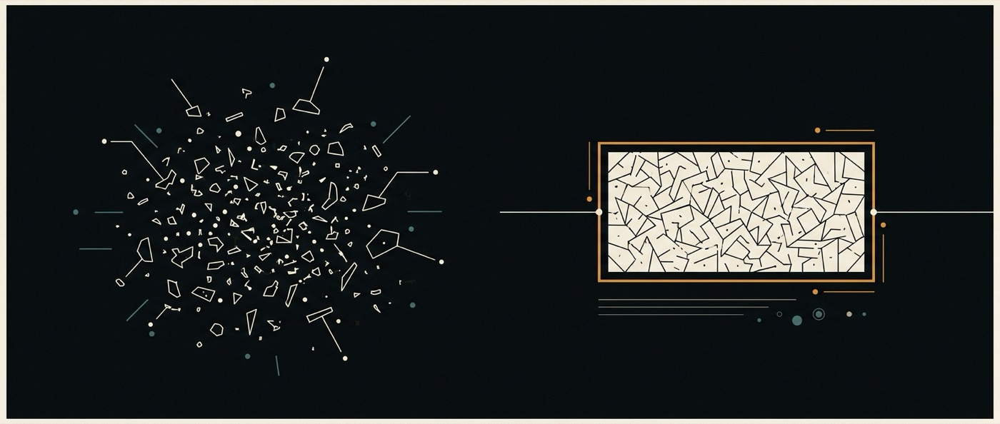

# 00 · Vision

Scattered talk becoming one durable object.

> **Project.** Why this exists. Nothing here is a claim about running software.

## The claim

Agents today are **applications**. ai-os is the argument that they should be an
**operating system** — and that the difference is not branding, but four specific
missing abstractions.

### The same gap, said the other way

Y Combinator, 2026-07-31 —
[@ycombinator](https://x.com/ycombinator/status/2079963728439832823):

> The best work tools became more powerful when they became multiplayer. But AI
> is still mostly trapped in private chats, with agents working in sessions that
> teammates can't join or influence.

That is this document's argument arriving from the opposite direction. We reached
it from *"an operating system needs a unit of work"*; they reach it from *"work is
multiplayer"*. Both land on the same object.

The bridge is one sentence: **you cannot hand off a conversation.** A handoff
needs something with a declared goal, a current state and a history — something a
second person can open, read, redirect and take over. A session is none of those.
It is private to its participants, summarised away by compaction, and forked
without recording that it forked. The unit is wrong, so everything above it is
single-player by construction.

Worth keeping honest about which claim we are making: theirs says *"in real
time"*. Ours is **asynchronous multiplayer** — a durable object several people act
on across days, hand off, fork and rejoin. Real-time co-presence is a legitimate
goal and not the one we build toward first ([04-ai-ui](04-ai-ui.md#scope-of-v1)
excludes simultaneous editing from v1). Handing off work that is *still running*,
without losing what it learned, is the harder half and the part nobody has.

An operating system earns the name when it owns four things: how work is
scheduled and survives interruption, how resources are isolated between tenants,
how state persists and is addressed, and how the user perceives and steers the
whole machine. QM already owns the second one properly. The other three are
where ai-os lives.

## What is actually missing today

Take any current agent product, QM included, and ask four questions.

**"What is this agent working on?"** The honest answer is a list of sessions.
A session is a conversation, not a unit of work. It has no declared goal, no
success condition, no relationship to the session that preceded it. When a
conversation is compacted, the work does not survive it — a summary of it does.
There is no object you can point at and say *that is the thing being done*.

**"What does it know, and why?"** Memory is a file. In QM it is literally
`memory/MEMORY.md`, a bulleted list capped at 300 facts that drops the oldest
when it overflows (`ai-base/src/memory/memory-service.ts`). Everything the system
has ever learned is one flat namespace per scope, with no notion that a fact
belongs to *this project* or *that flow* rather than to you personally, and no
way to ask why a fact is there.

**"What is it looking at?"** A chat log and some panels. The interface is a
transcript of what was said, scrolling away from you, which is the correct
metaphor for a conversation and the wrong one for work that spans weeks and
involves twelve artifacts.

**"Can I take this run and branch it?"** You can fork a session — QM has the
endpoint (`ai-base/src/api/app-sessions.ts:392`). Nothing records that the fork
*is* a fork: there is no parent pointer anywhere in the codebase, only an audit
log row. So you can branch, and you can never diff, merge, or explain the
divergence afterwards.

Those four are not bugs. They are the layer nobody has built, because everybody
is still building the application.

## The four pillars

**`ai-flows` — work above the turn.** A flow is a declared, persisted,
resumable unit of work with a goal, a shape, a state, and a history. It outlives
the session that started it, spans multiple agents and surfaces, survives
compaction and restart, and can be inspected, paused, forked and replayed. The
turn becomes an implementation detail of the flow, not the top-level object.

**`ai-ui` — the intelligent canvas.** A spatial, live surface where the flow, its
artifacts, its agents and its state are *objects you arrange*, not messages that
scroll. The canvas is intelligent in a specific sense: it is generated and
re-generated by the system from the state of the work, rather than assembled by
hand. What you see is a projection of the flow, not a log of the conversation.

**`ai-storage` — memory with an address space.** Four levels — system, user,
project, flow — each with its own lifetime, visibility and consolidation policy.
A fact learned inside a flow does not silently become something you believe
forever. Promotion between levels is explicit and reversible. This is the piece
where the organisation already has real work to draw on and, honestly, also the
piece where its previous attempt measured no better than the naive approach; see
[05-ai-storage](05-ai-storage.md) for how that shapes the design.

**`ai-base` — the operational base.** QM. Identity, scopes, permissions,
sandboxes, audit, the model layer, Slack and web surfaces, deployment. We did not
write it and we are not rewriting it.

## What this is not

- **Not a QM competitor.** If a change belongs upstream it goes upstream. The
  fork exists so we can move fast on the layer above, not to relitigate the base.
- **Not a framework.** This organisation has built agent frameworks repeatedly
  and deleted them; the last time it deleted 10,165 lines because an SDK had
  overtaken them. ai-os adds abstractions the base genuinely lacks, and adopts
  everything else.
- **Not a research project.** Every pillar has to run against real work, or it
  is not in the repository.

## The honest risk

The pattern this organisation repeats is: a coherent architecture, documented
thoroughly, never pinned to anything that could contradict it. The previous
flagship shipped 18,680 lines with three test functions.

So the falsifiable commitment for ai-os is stated here, at the top, before any
code: **each pillar ships with the measurement that would show it is not worth
it.** For flows, that a flow completes work that a plain session loses. For
storage, that scoped memory retrieves better than one flat file — the exact claim
that came back flat last time. For the canvas, that a user finds state faster than
in a transcript. A pillar without its measurement is not done, however much of it
is written.
