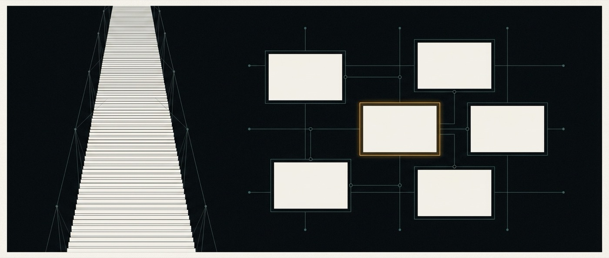
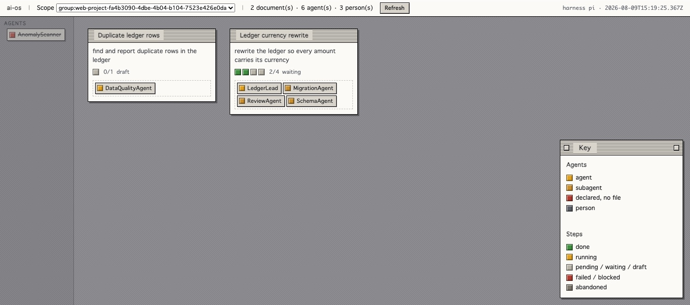

# 04 · ai-ui — the intelligent canvas

A stream rearranged into a map.

> **Reference.** Built and running — `ai-ui/`, 61 tests. Unproven.
>
> The desk exists: documents, agent cubes, the trace face, layout that persists
> per scope. What has *not* happened is the falsification at the foot of this
> document — the stopwatch, a three-day-old flow somebody else ran, desk against
> transcript. Until that runs, the honest claim is that it works, not that it
> helps. See [the manual, Part 6](manual.md).

## The problem

QM's web UI is a good chat application: two concurrent sessions, a sidebar of
files, crons, keychain, deploys, memory and skills. Vite + Lit, with
`dockview-core` doing panel layout (`ai-base/plugins/web-ui/`).

A transcript is the right shape for a conversation and the wrong shape for work.
Three concrete failures:

1. **The present scrolls away.** The current state of the work is derived by
   reading upward through history. In work spanning weeks, the answer to "where
   is this" is not in the last message.
2. **Artifacts are mentioned, not held.** A file, an app, a draft, a decision —
   each appears as a message *about* it, and then recedes at the same rate as
   small talk.
3. **The panels are a fixed menu.** Files, crons, keychain, skills — the same
   panels regardless of what you are doing. The interface has no opinion about
   the work.

## The claim

> The interface should be a **projection of the state of the work**, spatial and
> live, generated by the system — not a log of what was said.

## What "intelligent canvas" means

Precisely, so it does not degrade into "a canvas with AI in it":

**Spatial.** Objects have positions and persist. A flow, its steps, its
artifacts, its agents, its open questions are things you arrange and return to,
not messages you scroll past. Position is meaningful and is saved.

**Live.** Objects reflect current state without being re-asked. A step running is
visibly running. An artifact changed by an agent updates in place.

**Generated.** This is the load-bearing word. The canvas is *composed by the
system from the flow's state* — the shape of a Fan-out flow over 40 threads is
not the shape of a Deliberation over three architectures, and the user should not
be assembling either by hand. The system proposes the arrangement; the user
overrides it; **the override is remembered** and beats the proposal from then on.

**Steerable.** Direct manipulation is a first-class input alongside text. Moving
a step, splitting an artifact, marking a branch dead — all are instructions, not
just view changes.

The failure mode to design against: a generated layout that rearranges itself
under the user's hands. **Rule: the system proposes on state change; it never
re-arranges what the user has touched.**

## The metaphor: a desk, not a dashboard — decided 2026-08-09

The four words above say what the canvas *does*. They say nothing about what it
should look like, and the first thing built from them — a flat dark document —
drew exactly one complaint: **it was unclear.** Everything on it had the same
weight, so nothing told you what kind of thing you were looking at.

The answer is a metaphor old enough to have been tested on people who had never
used a computer: **the desktop of System 7 and Windows 3.1.**

- **A window is a boundary.** A title bar and a border tell you where one thing
  ends and the next begins, before you read either.
- **A bevel is a surface.** Raised means a thing; recessed means a container that
  holds things. It is a depth cue that needs no legend.
- **A coloured block is a kind.** One colour per scope role, per agent, per step
  state, used nowhere else — a flow's progress becomes a strip of cubes you can
  count from across the room, and *where* it stopped is visible without reading.
- **A document is a document.** A flow is a page with a folded corner, because
  that is what it is: a titled thing somebody has to pick back up.
- **Trays hold work.** In-tray for what is still moving, out-tray for what has
  settled. This is not decoration — "where is this and is anyone holding it" is
  the question the canvas exists to answer, so it should be the question the
  layout answers first.

This is already **[ran]**: the read-only explorer in `ai-flows/src/view.ts` was
rebuilt this way, and its screenshots are in [the manual](manual.md). The canvas
inherits the vocabulary rather than inventing a second one.

What the canvas adds on top is exactly the four properties above — position that
persists, state that updates in place, arrangement composed from the flow's
shape, and direct manipulation as input. The explorer has none of them **on
purpose**, which is what makes it the control arm: see § How this gets falsified.

One thing the period does *not* get a vote on. Nine-point Geneva on a 640×480
screen was a constraint, not a goal, and reproducing it would trade away the
clarity the metaphor was adopted for. **Period chrome, present-day type.**

## Why a projection rather than a transcript — the sampling reason

The claim above reads as taste. It is not, and the reason is worth stating
because it converts an aesthetic into a constraint.

A person looks at a flow at some rate — realistically once or twice a day. The
flow produces attempts at its own rate, which may be several per hour. **A
viewer sampling at $f_s$ can only faithfully observe change slower than
$f_s/2$.** Everything faster does not vanish: it *aliases*, and comes back
disguised as a slow trend that is not there. Three unrelated reversals inside a
day, sampled once, read as a direction.

A transcript is the raw stream at full rate handed to an observer sampling far
below it. It is not merely verbose — as a signal it is **wrong**, and wrong in
the specific direction of manufacturing false narrative.

Two consequences for v1, both cheap:

1. **A projection declares the rate of change it represents.** "State as of the
   last 6 hours" is a different object from "state now", and a canvas that does
   not say which one it is showing is inviting the reader to infer a trend from
   noise.
2. **Faster-than-sampled change is aggregated, never dropped.** Dropping is what
   produces aliasing; summarising is what avoids it. Fifteen attempts since you
   last looked is one object that says *fifteen attempts, this is where it
   landed* — not the last one, and not all fifteen.

This adds no mechanism. It gives the existing commitment a reason and a testable
rule, and it is the same argument [10-observability](10-observability.md) makes
one level down, where the instrument being sampled is the flow itself.

## Relationship to the existing web-ui

`ai-ui` is a **fifth plugin**, built against the same chassis as `web-ui`,
`admin`, `portal` and `auth`. It does not fork or replace `web-ui`, for two
reasons: `web-ui` is the surface the whole upstream keeps working, and running
both lets us compare them on real work instead of asserting the canvas is better.

**It lives in `ai-base/deploy/layers/evolvingagents/plugins/`** — QM's sanctioned
location for an organization's own service images
(`ai-base/deploy/layers/README.md`). This is the one pillar that needs no core
divergence whatsoever: it is exactly the customization upstream designed the
layer boundary for. Source stays under `ai-ui/`; the layer holds its deployment
image and config.

Where the canvas needs data QM's API does not expose, the fix is a route in
`ai-flows`, not a special channel into core.

### The chassis contract, verified

`ai-base/plugins/chassis/package.json` — *"source-auth signing, the signed
core-client helpers, small `node:http` request/response helpers, error helpers,
and the common `CORE_*` env block… never imports core."*

Consequences we accept:

- `ai-ui` talks to core over **signed HTTP only**. No shared process, no direct
  store access.
- Auth, identity and scope come from core. The canvas renders what the caller's
  scope permits and never widens it.
- The chassis is source-only and unpublished; Docker images copy
  `plugins/chassis` alongside each plugin. `ai-ui` follows the same packaging.

## Technology

Start from what upstream already runs, and diverge only where the canvas demands
it:

| Concern | Choice | Why |
|---|---|---|
| Rendering | Lit | What `web-ui` uses; no second framework in one repo |
| Layout | `dockview-core`, then reassess | Already a dependency; docking panels are a weak canvas but a real starting point |
| Transport | Chassis signed HTTP + core's existing streaming | Do not invent a second protocol |
| Canvas surface | **Open** | Docking panels may not survive contact with a spatial canvas. Decide after the first real flow renders, not now |

That last row is deliberately unresolved. Choosing a canvas engine before a real
flow has been rendered is the kind of decision this organisation has made too
early before.

## Scope of v1

**In:** render one running flow — steps, states, artifacts, the active agent;
live updates; direct manipulation of step state; persisted per-scope layout;
system-proposed arrangement per flow shape, overridable and sticky.

**Out:** replacing `web-ui`; Slack (that surface stays as upstream ships it);
multi-user simultaneous canvas editing; a general diagramming tool.

## Built, and what "built" means here — 2026-08-09 [ran]

Two flows as documents, each with its agent cubes stacked on it, the shelf on the left holding agents with no work, and the key. From a live instance. <code>AnomalyScanner</code> is struck through and cannot be dragged: it is declared in <code>DataQualityAgent.md</code> with no file behind it.

`ai-ui` exists. It is one package — a layout model, a layout store, a render and a
server — talking to `ai-flows` over the signed seam and owning nothing but the
arrangement.

The four properties, and how each is discharged:

| | |
|---|---|
| **Spatial** | Drag a document; it is still there after a reload, from `ui_desk_layout` keyed by scope. **[ran]** |
| **Live** | The desk re-reads state every five seconds, and the agent of a running step is the one thing on the desk that animates |
| **Generated** | `propose()` lays documents into a grid and stacks each agent's cube on the flow whose steps name it |
| **Steerable** | Dropping a cube on a document appends a delegation step — the same instruction `compose.ts` writes, asserted byte-for-byte by a test |

**The load-bearing part is not the rendering.** It is `layout.ts`, and specifically
what happens to the arrangement a person made when the system wants to propose a
new one. Every placement carries a `pinned` bit set the moment a human drags it,
and `propose()` routes around pinned things rather than overwriting them. A canvas
that gets this wrong throws away the user's work every time a step finishes —
which is exactly when they are looking at it. That rule is a property of a pure
function here, and eight tests hold it against the events that would break it: a
flow finishing, a flow appearing, a flow being deleted.

One case is worth naming because it is the one that bites. Drop `ReviewAgent` on a
document; the desk re-proposes from flow state; `ReviewAgent` is not in that
flow's steps *yet*, because the step it just created has not run. Re-deriving
would snap the cube back and undo the assignment in front of the person who made
it. So a pinned cube keeps its document.

### What it deliberately does not do

**Reading the desk never spends a model call.** `POST /assign` writes a step and
`POST /advance` runs one; everything else is a read. The desk polls itself, so a
canvas where rendering could trigger work would spend money because somebody left
a tab open. Advancing is a click, with the cost stated on the button's own panel
before it is pressed.

**No build step.** The client is one string of plain JS. This pillar is the one
most at risk of costing a quarter of infrastructure before it has earned one, and
a bundler is the first instalment of that bill. If the stopwatch below says the
canvas wins, a build step is cheap to add and will have been paid for.

## How this gets falsified

**The measurement:** a user, and a flow they did not run themselves, three days
old. Time to answer: *what is the state, what is blocked, what did it produce?*
Canvas versus `web-ui` transcript.

**The claim:** the canvas is faster, and the gap widens with flow age.

**If it is not faster, ai-ui is decoration.** This is the pillar most vulnerable
to being beautiful and useless, so the measurement is a stopwatch on a real task
and not an opinion about how it looks.
