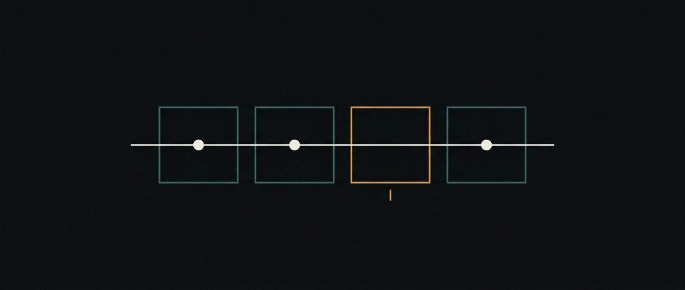

# 13 · Degradation — why a system that was configured well stops being right

A review step that runs, reports, and adds nothing.

> **Status: a documented failure mode and one measurement of our own. Nothing here
> is built.** This document exists to name a thing ai-os cannot currently notice,
> and to state what noticing it would take — not to claim it does.

Everything else in `doc/` asks whether a design is worth building. This one asks a
different question: **once it is running, how would anyone find out it had stopped
being good?**

The answer today is that they would not. ai-os can tell whether a flow is *moving*
([10-observability](10-observability.md), δ measured). It has no instrument at all
for whether the work is *getting worse*. Those are different failures, and the
second one is quieter.

## The case: oversight that did not help

Google DeepMind / Google Research, *Towards physician-centered oversight of
conversational diagnostic AI* ([arXiv:2507.15743](https://arxiv.org/abs/2507.15743)).
A randomized, blinded virtual OSCE over **60 scenarios**. An agent, g-AMIE,
conducted intake and proposed a differential diagnosis and a management plan; a
supervising primary-care physician then reviewed and could edit both before
anything was issued. Human-in-the-loop, done properly: the human has the last
word, sees everything, and can change anything.

The finding, quoted exactly **[read]**:

> "in 93.3% of scenarios, edits did not improve (in 21.7% edits reduced)
> diagnostic quality"

Which resolves to:

| physician edits | share of scenarios |
|---|---:|
| improved diagnostic quality | **6.7%** |
| changed nothing either way | 71.6% |
| **reduced** diagnostic quality | **21.7%** |

### What this does not say

It is not *"human review makes AI output worse"*, and reading it that way throws
away the most useful part. The same paper reports the same measure for the human
control arms: edits did not improve **80%** of the g-PCP cases and **83.3%** of the
g-NP/PA cases — so oversight improved roughly 20% and 17% of *human* work against
6.7% of the agent's.

The asymmetry is the finding. **Oversight added least where the output was already
strong**, and where it did act, it subtracted about as often as it added. The
review step was not worthless in principle; it was applied to something with very
little headroom left, by a reviewer whose judgement was worth less on that
particular margin than the thing being reviewed.

## The same shape, in our own system, measured today

On 2026-08-07 a composed flow ran three project agents in sequence:
`SchemaAgent → MigrationAgent → ReviewAgent`. Every step completed. The flow
reached `done`. The page rendered green.

`ReviewAgent` returned **[ran]**:

> "There are no files in the workspace to review. There is no change visible, so I
> cannot point to any defect on any line."

It was right, and it was useless. Each delegation started with an isolated
context, so the reviewer had never been shown the schema the first step proposed.
**A review step ran, reported cleanly, and added nothing — while every signal the
system had said the flow succeeded.**

Same agents, same goal, after each step was handed the results of the ones before
it:

> "**Defect 1 — Line 4:** `NULL` on the `currency` column violates the invariant
> that every ledger must have a well-defined currency."

Nothing about the *configuration* changed between those two runs. The agents, their
markdown, their declared tree, the tools they were given — all identical. What
changed was one property of the **execution**: what each step could see.

That is the whole argument of this document in one pair of quotes. **A
configuration that looks optimal on paper is not evidence about the system that
runs.** The first run was not a bug report anybody would have filed: it finished,
it was fast, and every check passed.

## What ai-os would need to notice this

Being precise about the gap, because "the agents should adapt" is a wish until it
names a signal:

**What exists.** `observabilityOf` answers *is this flow still moving?* from
attempt digests, against a measured noise floor
([10-observability](10-observability.md)). It would have called both runs above
`progressing`. It is not wrong — they were.

**What does not exist, in order of cheapness:**

1. **A step's contribution.** In the failed run, `ReviewAgent`'s output was
   near-identical in information content to no step at all. A step whose
   observation digest tells you nothing you did not already have from the previous
   step is a step that did not contribute — and `digestOf` is already the
   instrument that could say so. **This is the cheap one, and it is not built.**
2. **Headroom, before oversight is added.** The g-AMIE result is the clinical
   version of a rule this repository already had to learn: **check headroom before
   building the treatment**. Its own memory benchmark scored the baseline 10/10 and
   its physics suite passed 12/12 — in both, every arm tied at the ceiling and the
   tie read as a success ([08 § M4](08-roadmap.md)). A review step added to work
   that is already right will, at best, do nothing.
3. **Whether an intervention helped.** The paper could compute this because it had
   a ground-truth grader. ai-os does not, for general work, and inventing one is
   the expensive path — which is why (1) comes first.

## Where this points, and how it gets falsified

The direction is the one the case suggests: **an agent system should be able to
report on its own execution, not only produce output** — a step that flags "I was
given nothing to work with" is more valuable than a step that quietly answers
anyway. The declared agent tree
([12-conformation](12-conformation.md)) is the configuration; this document is
about the distance between it and what happens.

But the claim has to be falsifiable or it is a slogan:

> **Falsification.** Build (1) — flag a step whose observation adds nothing over
> its predecessor — and run it over real flows. If it fires on runs that were
> genuinely fine as often as on runs that were not, it is noise and should be
> deleted rather than tuned. If it never fires, the failure mode above was a
> one-off and this document is a story rather than a design input.

The honest prior is that (1) will be noisy: a step that legitimately restates its
input looks identical to one that failed to add anything. That is exactly the
distinction δ was built to reason about, and it is why this reuses that instrument
instead of proposing a new one.

## The rule this leaves behind

Short enough to survive:

> **The configuration is a hypothesis. The execution is the evidence.** An agent
> tree that looks right, with the right tools and the right descriptions, is a
> claim about a system that has not run yet — and the failure it is most likely to
> hide is a step that succeeds without contributing.
