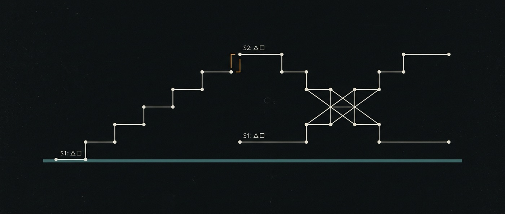

# 11 · Elegir un modelo — el lift no es el número que decide



<sub>Dos lifts que parecen resultados. La distancia entre sus cimas es el único número que decide — y cambia de signo.</sub>

> **Estado: estimadores implementados y testeados. No se corrió ninguna comparación
> de modelos.** `ai-flows/src/stats.ts` y `conformance.ts` — 34 tests **[ran]**;
> 73 en todo `ai-flows`. Todavía no hay suite de tareas ni un segundo modelo, y
> este documento tiene cuidado de decir qué está citado y qué está medido.

## La pregunta, y la trampa que tiene adentro

¿Puede un modelo chico detrás de un buen harness reemplazar a uno de frontera?

El reflejo es medir el lift del harness: puntuar el modelo chico pelado, después
con tools, subagentes, memoria y contexto estructurado, y leer la diferencia. Ese
número siempre es grande y siempre es al lado de la cuestión.

**Tu competidor también corre un harness.** Así que la comparación que decide algo
es `chico+harness` contra `frontier+harness`, y el chico cierra la brecha solo si
el harness lo levanta *más*. Esa diferencia de diferencias — el **término de
interacción** — es la cantidad, y puede estar cerca de cero con ambos lifts
enormes.

```
                    pelado       harness        lift
  chico              0.03          0.90        +0.87
  frontier           0.14          0.88        +0.74
                                     interacción       +0.13
```

Dos lifts que cada uno daría para un blogpost, y una decisión que cuelga del
tercer número.

## Tres cosas que la literatura ya resolvió

Pagadas leyendo, no con GPU.

**El signo se da vuelta con la dificultad.** Una comparación controlada y
pre-registrada — tres scaffolds × cinco modelos × GAIA niveles 1 y 2, tareas
fijas, tres intentos por pregunta ([arXiv:2606.08529](https://arxiv.org/abs/2606.08529))
— reporta que la predicción de que los modelos más capaces son menos sensibles al
scaffold *"queda rechazada en dirección"*: el modelo más capaz **ganó más** con
scaffolds estructurados en el nivel difícil, y el escalonamiento por tier se
sostuvo solo en el nivel fácil. Sustitución en trabajo fácil, complementariedad en
trabajo difícil.

**Entonces un término de interacción agrupado no es un hallazgo.** Puede quedar en
cero mientras el efecto es fuertemente positivo en tareas fáciles y fuertemente
negativo en difíciles. `interactionByStratum` y `crossingPoint` existen porque
**el punto de cruce es el límite de producto**: abajo una flota chica es
defendible, en él y arriba el frontier se despega más cuanto mejor sea tu scaffold.

**La estructura de la tarea decide más que la elección del modelo.** La
coordinación multiagente da **+80.9%** en tareas descomponibles y **−39% a −70%**
en razonamiento secuencial; un orquestador que valida contiene la amplificación de
error en **4.4×** contra **17.2×** de agentes paralelos independientes; y la
arquitectura se predice desde la estructura de la tarea con R² = 0.513, acertando
en 87% de tareas no vistas
([Google Research](https://research.google/blog/towards-a-science-of-scaling-agent-systems-when-and-why-agent-systems-work/)).

**La composición por paso tiene respaldo.** El éxito de agentes en tareas largas se
modela bien con una tasa de falla constante por paso — decaimiento exponencial,
cada agente con su vida media ([arXiv:2505.05115](https://arxiv.org/abs/2505.05115)).
Eso es `r^h`, la misma ley que `(1−δ)^w` en [10](10-observability.md). El autor
marca la generalización como desconocida, así que `calibrateCompounding` la chequea
sobre datos reales en vez de asumirla.

## Lo que apareció al construirlo **[ran]**

El estimador tiene un modo de falla que nadie predijo, y falla en la dirección
cara.

El log-odds está indefinido en 0 y 1, así que las celdas se corrigen sumando ½
antes de la transformación. Esa corrección también *encoge* los extremos — y
encoge un brazo cerca del piso distinto de uno cerca del techo. Los dos lifts
quedan comprimidos de manera desigual y la diferencia de diferencias hereda la
distancia.

Medido contra una construcción cuya interacción verdadera es **exactamente cero**:

| pasos por ítem | 4 | 8 | 16 | 32 | 64 | 128 |
|---|---|---|---|---|---|---|
| interacción medida | **+0.597** | **+0.394** | **+0.211** | +0.067 | −0.002 | −0.001 |
| ¿supera el cero? | **sí** | **sí** | **sí** | no | no | no |

Las tres primeras columnas son falsos positivos, y todas apuntan hacia *"enviá la
flota chica"*. Una evaluación con ocho observaciones por ítem habría producido una
respuesta confiada, equivocada y cara — a partir de un harness que no hace nada.

Treinta y dos es donde volvió el nulo; sesenta y cuatro recupera el signo casi
exacto (−1.248 contra −1.221, +1.199 contra +1.221). Por eso
`MIN_STEPS_PER_ITEM = 32`, y cada `Interaction` lleva `minStepsPerItem` y una
bandera `underpowered`. **Un resultado decisivo bajo esa bandera no es evidencia**,
y la bandera viaja con el número para que nadie lea el veredicto sin lo que lo
invalida — la misma regla que [10](10-observability.md) aplica a δ.

## La falla silenciosa que se ve igual que un hallazgo

`conformance.ts` es una compuerta, no un diagnóstico, y existe por un motivo
puntual.

Un adaptador puede fallar sin levantar nada: un modelo que contesta bien en prosa
y nunca llama a la tool, una respuesta cuyo contenido cae en un campo que quien
llama no lee, degradación que solo aparece cuando se acumula historial.

Si las tool calls se descartan en silencio, **todas las condiciones con harness
puntúan como peladas**. El lift desaparece, la interacción se va a cero, y el
resultado es indistinguible de un hallazgo honesto de que el harness no ayuda a
ese modelo. Nada en la estadística puede notar la diferencia.

Entonces: cinco chequeos, todos fallando ruidoso; el resultado asentado al lado de
la evaluación que autoriza; y un **vencimiento de 24 horas**, porque un endpoint
local se puede reiniciar con otra cuantización de un día para el otro y el eval
nunca se enteraría. Una evaluación cuyo adaptador no fue verificado no es
evidencia.

## Qué se sigue para el producto

No un veredicto enviar / no enviar. Una restricción de diseño, y cada cláusula la
carga un número de arriba:

> **Una flota de modelos chicos es viable para saltos cortos, verificables y
> descomponibles detrás de un orquestador que valida. No es viable como cadena
> larga, autónoma y secuencial.**

Cortos: los modelos de frontera aciertan en <10% de las tareas que a un humano le
llevan más de cuatro horas ([METR](https://metr.org/blog/2026-1-29-time-horizon-1-1/)).
Verificables: la corrección solo funciona donde los estados intermedios se pueden
chequear. Descomponibles: +80.9% contra −70%. Orquestador que valida: 17.2× → 4.4×.

La mitad negativa está sobre-determinada — el gap remanente entre abierto y
cerrado se concentra en razonamiento, contexto largo y capacidad agéntica
([Epoch](https://epoch.ai/data-insights/open-closed-eci-gap)), lo multiagente
degrada el trabajo secuencial, la complementariedad favorece al frontier en tareas
difíciles, y el error por paso compone. Cuatro resultados independientes, una
misma dirección.

## Cómo se falsifica

**Los estimadores** se falsifican con su propia calibración: tienen que recuperar
el signo de una construcción conocida a lo largo de las fuerzas de sustitución, y
devolver el nulo cuando el harness es neutral respecto de la capacidad. Eso es un
test, corre en CI, y es lo que cachó el sesgo de encogimiento de arriba.

**El programa por paso** se falsifica si `r^h` no predice el éxito de trayectoria
— si las fallas están correlacionadas entre pasos en vez de ser independientes.
`calibrateCompounding` reporta observado contra predicho por cantidad de saltos; un
error absoluto medio grande significa que la medición por paso no compone, que la
trayectoria tiene que ser la unidad después de todo, y que los tamaños de muestra
que eso cuesta son los que quedan fuera de alcance. **Testearlo en la primera
suite real, sin costo extra.**

**La conclusión de producto** se falsifica si un modelo chico detrás de un
orquestador que valida aguanta trabajo secuencial largo en un workload real,
contra cuatro resultados que predicen que no. Sería el desenlace más interesante
disponible acá.

## Qué no está construido

Dicho en presente, por la regla de casa 3.

- **No hay suite de tareas.** Los estimadores todavía no tienen de qué estimar. El
  paso siguiente es etiquetar un workload real por tiempo humano, secuencial
  contra descomponible, y verificabilidad — tres etiquetas, sin modelos, y entre
  ellas predicen la mayor parte de la respuesta.
- **No hay segundo modelo.** `deepseek/deepseek-v4-flash` corre en `pi` y su δ está
  medido ([10](10-observability.md)). Nada más está cableado, y **ningún modelo
  local pasó conformidad, porque no hay ninguno corriendo.**
- **No hay ε ni u.** Error de tarea y tasa de falla silenciosa necesitan un oráculo
  por tarea.
- **Las trayectorias todavía no son flows.** Deberían serlo cuando exista el motor
  de M2: un `Flow` con *h* steps **es** una trayectoria de *h* saltos, y
  `Attempt.observation` ya es el registro por paso (ADR-0007). Ahí `r` sale de
  `flow_attempts` en vez de ajustarse, el eval mide el sistema que se shippea en
  vez de una simulación, y se convierte en el harness de falsación que
  [03](03-ai-flows.md) ya debe. **Nada de esto puede demorar M2.**
