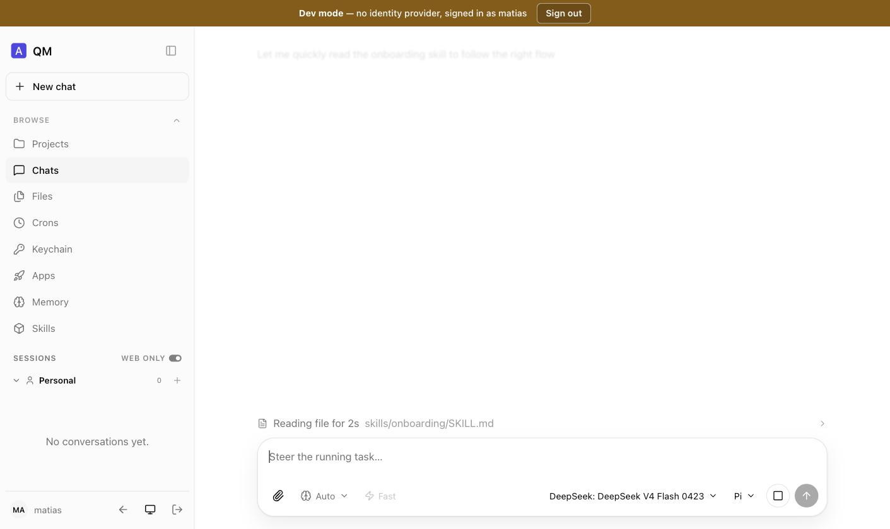

# Running ai-os — a manual for what exists today

**[Español](es/manual.md)**

> **Read this first.** ai-os is four pillars and only one of them is a running
> product. This manual documents **what actually starts and what you can actually
> see**, verified by doing it on 2026-08-06 **[ran]**. Where a screenshot shows a
> feature, that feature runs. Where this manual says something does not exist, it
> does not exist — see [§ What you cannot run](#what-you-cannot-run).
>
> **The web interface in these screenshots is QM's, not ours.** `ai-ui` — the
> spatial canvas of [04-ai-ui](04-ai-ui.md) — is a specification with no code.
> What you see below is `ai-base`, the vendored upstream, doing its job.

## What you get

| Component | Runs? | What you can do with it |
|---|---|---|
| `ai-base` (QM) | **yes** | Full agent surface: chat, projects, files, crons, memory, skills |
| `ai-flows` | **partly** | Two libraries with CLIs — the observability instrument and the conformation projector. No flow engine |
| `ai-ui` | no | Specified in [04](04-ai-ui.md). No code |
| `ai-storage` | no | Specified in [05](05-ai-storage.md). No code |

---

## Part 1 · Start the platform

### Prerequisites

- Node 24+ (`ai-base/.node-version` pins it)
- An `OPENROUTER_API_KEY` in `ai-base/.env` — the default harness is `pi`, which
  is the one that reaches non-Anthropic models
- Postgres is **optional**. Without it everything falls back to in-memory stores,
  which is enough to run and has one consequence documented in Part 4

### 1.1 The core

The core is an API, not a web page. It refuses unsigned requests by default, so a
local run needs the escape hatch upstream provides for exactly this
(`src/api/server.ts:476`). Note the condition: the flag alone is not enough, the
signing secret must also be **absent**.

```bash
cd ai-os/ai-base
ALLOW_UNAUTHENTICATED_CORE=1 ORG_ID=<your-org> PORT=8080 \
  HARNESS=pi OPENROUTER_API_KEY=<key> PI_MODEL=<model> \
  node src/index.ts
```

You want these two lines:

```
[server] ALLOW_UNAUTHENTICATED_CORE=1 — HTTP ingress is UNAUTHENTICATED (intentionally isolated deployments only).
[qm] listening on :8080 (org=…, store=memory, runStore=memory, workers=16, backgroundWork=true)
```

> **This turns off authentication.** It is for a laptop and an isolated
> deployment. Do not do this anywhere reachable. With `CORE_SIGNING_SECRET` set
> instead, every request must carry an HMAC signature and you need the portal for
> a browser session.

### 1.2 The web surface

A **separate process**, in `plugins/web-ui`. Its sign-in mode is decided by one
line (`server/index.ts:36`): with no `CORE_SIGNING_SECRET` it uses a local cookie
and a dev sign-in form; with one, it expects the portal and a real identity
provider.

```bash
cd ai-os/ai-base/plugins/web-ui
npm install && npm run build
CORE_API_URL=http://localhost:8080 CORE_ORG_ID=<your-org> PORT=8096 \
  node server/index.ts
```

```
[web-ui] surface on http://localhost:8096 → core http://localhost:8080 (org …)
[web-ui] WEB_UI_PRINCIPALS unset — any principal id may sign in (dev only)
```

Open `http://localhost:8096`, type any principal id, and you are in.



<sub>Signed in. The brown banner never lets you forget the instance is unauthenticated. Model and harness are pickable per turn — here DeepSeek V4 Flash on Pi.</sub>

---

## Part 2 · Projects are group scopes — see it yourself

This is the claim [ADR-0005](adr/0005-scale-is-scope.md) and
[12-conformation](12-conformation.md) rest on, and the UI proves it in its own
address bar.

Open **Projects → New project**, name it, and look at the URL:


```
http://localhost:8096/contexts?scope=group%3Aweb-project-2dde0e2d-…
```

URL-decoded that is **`group:web-project-<uuid>`** — a `group` scope with a
reserved prefix, exactly as `projects/project-store.ts:47` builds it. There is no
"project" object anywhere. **The roster is the panel on the right** ("People · 1 ·
OWNER"), served by `ProjectStore`, and it is the *only* place membership lives.


<sub>Every project is a scope; "Personal" is your `personal:` scope wearing a friendly name.</sub>

### An agent is a file, and the agent can write it

Ask the assistant, inside a project, to write `agents/reviewer.md`:


<sub>Scoped to "Conformation Demo context" — the write lands in that project's workspace, not yours.</sub>

On disk:

```
ai-base/data/workspaces/group__web-project-2dde0e2d-…/agents/reviewer.md
```

That is the whole "per-project agents folder" feature. It is a directory in the
scope's workspace, and any agent that can write files can create one.

> **The catch, and it is not small.** Workspace-defined markdown agents are read
> by exactly one caller in the tree, `pi-tools.ts` **[read]**. On `claude` the
> child agents are hardcoded; on `codex` and `opencode` delegation happens inside
> their CLI. **Your `agents/` folder does nothing on three of five harnesses.**

---

## Part 3 · The multi-agent system

This is the part that changed most on 2026-08-07, and everything below was
verified by running it **[ran]**.

### Every level, its people, and its agents — one page

`ai-flows` serves a page at `GET /` showing the whole system: the levels the OS
actually has, who is in each, and the agents each scope defines.

```bash
cd ai-os/ai-flows
FLOWS_SIGNING_SECRET=<secret> node --env-file=/path/to/core.env scripts/serve.ts
# → http://localhost:8097
```


<sub>System first, because <code>global/</code> is mounted read-only into every scope below it.</sub>

Read it top to bottom:

- **System** — `org:<your-org>`, whose `agents/` mount into every other scope as
  `global/agents/`.
- **Projects** — `group:web-project-<uuid>`, each with a **roster read from
  `ProjectStore`**. Membership is never read from a folder; see
  [ADR-0008](adr/0008-conformation-is-projected.md).
- **Groups & channels**, **Teams**, **Individuals** — the remaining scope kinds.

### Agents and sub-agents are markdown

An agent is `agents/<name>.md`. Frontmatter declares what it is; the body is its
system prompt:

```markdown
---
description: Owns the ledger rewrite. Splits work and routes it to the specialists.
tools: [read, write, execute]
subagents: [SchemaAgent, MigrationAgent, ReviewAgent]
---
You lead the ledger rewrite. Split the goal, route each piece to the agent in
your subagents list, and report what came back.
```

`description` and `tools` are upstream's. **`subagents:` is ours**, and it works
because upstream's parser validates those three fields and ignores every other
key — so the same file stays a valid, delegatable agent while carrying the tree.
There is no sidecar registry and no schema to keep in sync.

A declared name with no file renders struck through as **`declared, no file`**.
That is deliberate: a declared name is a claim, a file is a fact, and a tree that
renders a typo as a working composition is worse than no tree.

### Running a tree

`POST /flows/from-agent` turns the declared tree into a flow. Use `?dryRun=1`
first — a hand-declared tree is exactly the thing to look at before it spends
model calls.

```jsonc
POST /flows/from-agent?dryRun=1
{ "scopeId": "group:web-project-…", "agent": "LedgerLead", "goal": "add a currency column" }

// → step -> SchemaAgent     via:delegate depth:1
//   step -> MigrationAgent  via:delegate depth:1
//   step -> ReviewAgent     via:delegate depth:1
```

Drop `?dryRun=1` to create it, then `POST /flows/:id/advance` per step.


<sub>Each step is a real delegation to the agent's own markdown file.</sub>

### What composition does not do, and why

**Depth is flattened, not honoured.** A delegated child is built without
`runChild` (`pi-harness.ts:1313-1318`), so **an agent cannot delegate to its own
sub-agent**. What runs is the pattern llmunix's SystemAgent uses: the
orchestrating session reads the tree and delegates to each named agent itself. A
deeper tree contributes its descendants as further steps in the same flat
sequence, and the plan says so rather than leaving you to notice.

**A system agent cannot be delegated to from a project.** `delegate` resolves
`agents/<name>.md` against the scope's own root; the system scope mounts at
`global/` and agent names cannot contain `/`. The composer marks those steps
`inline` — the instructions are pasted into the step instead. That is strictly
worse (no isolated context, no tool narrowing) and it is labelled so nobody reads
an inlined step as a delegated one.

### Two write paths, and using the wrong one fails silently

The single most useful thing in this manual, because getting it wrong produces a
page that renders perfectly and a runtime that finds nothing:

| Layer | Materialised from | Write agents with |
|---|---|---|
| `global/` — the org scope, read-only | the `WorkspaceStore`, **rebuilt every turn** | `workspace.write()`. It is also the **only** way: `scopeFor` returns `personal`, `group` or `channel` and never `org`, so no conversation can reach the system scope |
| your own scope, read-write | the **persisted sandbox** | a **turn** — ask the agent to `write` the file |

`ro-layers.ts` opens with `if (layer.mode === "rw") continue;`. Measured: after
writing six agent files to the store for a project scope, `ls -1 agents/` inside
that scope's sandbox returned **two**, and a seventh written and listed a minute
later never appeared. Materialisation runs sandbox → store, not the reverse.

`scripts/seed-demo.ts` builds the whole demonstration above — system agents,
project, roster, trees — using the correct path for each layer.

```bash
node --env-file=/path/to/core.env scripts/seed-demo.ts
```

### One thing that is a stopgap, and is not pretending otherwise

A shared scope refuses a turn from a non-member, and **a flow records no actor** —
it has a `scopeId` and nothing about who it acts for. `FLOWS_ACTOR` names one
principal who must be a member of every scope the server runs flows in. It is
wrong the way shared service accounts are always wrong: every flow in the audit
log is attributed to the same person regardless of who asked for it.

This is [ADR-0008](adr/0008-conformation-is-projected.md)'s condition for agent
principals firing — *an agent that must appear in a roster* — and it is recorded
rather than papered over.

---

## Part 4 · The conformation projector

The one thing in `ai-flows` you can point at a real system. It answers *what shape
is this system in, and who has been talking to whom* — read-only, no writes, no
tables.

```bash
cd ai-os/ai-flows
node --env-file-if-exists=../ai-base/.env scripts/conformation-probe.ts --data ../ai-base/data
```

Against the instance from Part 2:

```
conformation @ 2026-08-06T21:15:09Z  harness=pi  digest=a197a05cbf3dfcbf

project    group:web-project-2dde0e2d-0b07-4554-8bef-353f7c8400e7
  agent  reviewer [read] Reviews a change against project policy.
system     org:evolvingagents
individual personal:matias
  memory MEMORY.md

holes (3) — these are the deliverable:
  [-] Which scopes exist?
  [group:web-project-…] Who is on this project's roster?
  [-] Who has been talking to whom?
```

Flags: `--json` for the document instead of the rendering, `--seed` to write a
fixture first, `--converse` to run two real turns so the graph has edges.

### Holes are the point

A projection's failure mode is silence — a view that renders cleanly because it
did not ask. So every unanswerable question is printed. **Read the holes first;
they are more informative than the tree.**

---

## Part 5 · What the holes told us, running it live

Three findings from the exact run above, and they are the reason this manual is
worth more than a feature list.

**The roster hole is correct, and the UI proves it.** The screenshot in Part 2
shows "People · 1 · OWNER". The projector says it cannot see the roster. Both are
true: with `store=memory` the `ProjectStore` lives *inside the running core's
process*, so a second process reading the same `dataDir` sees the workspace files
and none of the state. **Run Postgres if you want conformation across processes.**

**A project can exist with no workspace at all.** Immediately after creation the
projector could not see the project — the directory materialises only when a turn
writes something. Scope enumeration is a session fact, not a workspace fact, and
no store answers it directly.

**Attribution had to be rebuilt.** `meta.author` is written from
`actor.displayName` and nothing else (`core/orchestrator.ts:2170`), so turns from
a surface that supplies no display name — and **every reply the assistant makes** —
are unattributed. `ai-flows` recovers this from participant windows: 4 of 4 on the
measured pair, with the principal id rather than the display name
([12-conformation](12-conformation.md#attribution-recovered)).

---

## What you cannot run

Stated plainly, because a manual that omits this is a brochure:

- **There is no canvas, and the flow engine is now built.** M2 was delivered on
  2026-08-06 — a flow started by one process and finished by another, 6/6 on both
  `pi` and `mock` ([08-roadmap § M2](08-roadmap.md)). What is still absent is
  everything above one shape: no `Sequence`, `Loop`, `Fan-out`, `Deliberation` or
  `Watch`, and no merge.
- **There is no canvas.** `ai-ui` is [04](04-ai-ui.md) and nothing else. The UI in
  this manual is upstream's.
- **There is no scoped memory.** `ai-storage` is [05](05-ai-storage.md) and
  nothing else. The `Memory` tab you see is QM's flat `MEMORY.md`.
- **Orchestrator agents still cannot have their own sub-agents.** Delegation is
  capped at one level, deliberately, in one line (`pi-harness.ts:1313-1318`). A
  declared tree is composition the *session* executes, flattened — see Part 3.
- **Agents are not principals.** `PrincipalType = "internal" | "guest"`. An agent
  cannot be on a roster or hold its own permissions.

## Shutting down

```bash
pkill -f "src/index.ts"          # core
pkill -f "web-ui/server/index.ts"  # surface
```

In-memory stores mean everything except workspace files disappears with the
process. That is a configuration choice, not a defect — set `DATABASE_URL` to keep
it.
