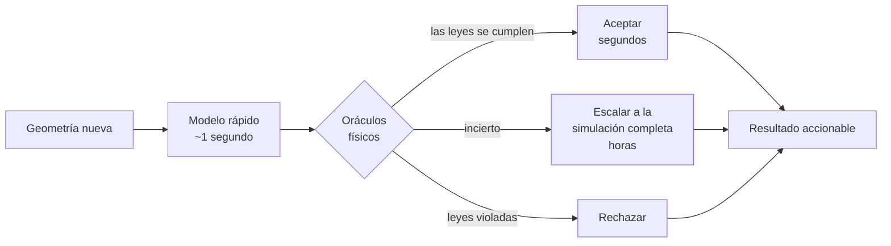

# Podemos hacer la simulación mil veces más rápida. Seguimos sin saber cuándo se equivoca.

Simular cómo se mueve la sangre dentro de una cavidad del corazón es algo que las
computadoras hacen bien y despacio. Horas por caso. Hoy existen redes neuronales
que aprenden a imitar esas simulaciones y responden en aproximadamente un
segundo, lo que parecería ser el final de la historia.

No lo es, y el motivo es incómodo: **cuando estos modelos se equivocan, se
equivocan con exactamente la misma cara de seguridad que cuando aciertan.**

Todos los trabajos informan el error promedio sobre un conjunto de prueba. Un
promedio es una cifra razonable para publicar e inútil para actuar. Nadie trata un
promedio. Tenés una geometría adelante, una predicción, y ninguna respuesta
correcta contra la cual compararla — porque si tuvieras la respuesta correcta no
habrías necesitado el modelo.

Así que lo que falta no es un modelo mejor. Es un árbitro.

## Verificar una respuesta sin conocer la respuesta

Acá está lo que vuelve tratable el problema. La física impone reglas que se pueden
chequear sobre la predicción sola.

La sangre no puede aparecer ni desaparecer: lo que entra tiene que salir. No puede
deslizarse sin fricción pegada a una pared; tiene que frenarse contra ella. La
energía tiene que cerrar. Ninguna de esas cosas requiere saber cuál era la
respuesta verdadera.

Es la misma razón por la que podés detectar un resumen bancario adulterado sin
tener idea de qué compró la persona. Las cuentas tienen que cerrar. Si no cierran,
algo está mal, y eso lo aprendiste de la estructura del documento y no de la
verdad que hay detrás.

Esa es la idea completa: un conjunto de chequeos físicos independientes —los
llamamos oráculos— que leen una predicción y la puntúan sin haber visto jamás la
respuesta correcta.

## El producto es el circuito, no el modelo

Lo que estás comprando no es velocidad. Es **velocidad donde es seguro y precisión
donde no lo es**, con algo distinto del optimismo decidiendo cuál es cuál.

## Cómo te miente esta medición

Hay una trampa evidente, y vale nombrarla porque es fácil caer en ella mientras
producís números hermosos.

Podés medir qué tan bien el árbitro separa las predicciones buenas de las malas y
sacar un puntaje excelente. Podés medir por separado que el modelo rápido es mil
veces más veloz que la simulación. Las dos cosas ciertas, y el sistema puede seguir
sin valer nada — porque si el árbitro es desconfiado y manda igual el 80% de los
casos a la simulación lenta, no ahorraste absolutamente nada.

Los dos números solo significan algo multiplicados entre sí. Por eso la métrica que
este proyecto reporta es una sola, acoplada: **cuánto cómputo se ahorra realmente,
manteniendo los errores por debajo de una tasa acordada**, con la fracción de
escalado impresa justo al lado. Se reportan juntos o no se reportan.

## No examines al alumno sobre las preguntas que estudió

Esta es la parte que me resulta más interesante, y que generaliza bastante más allá
de los corazones.

La tentación es entrenar al modelo para que respete las leyes físicas —meter la ley
como penalización en la función de pérdida— y después usar esas mismas leyes como
examen. Se siente riguroso. Es casi circular.

Un modelo entrenado para minimizar un residuo va a minimizar ese residuo. Puede
empujar ese número hacia abajo sin que el campo subyacente esté bien donde importa,
y el chequeo queda satisfecho por construcción. **Un examen sobre exactamente lo
que alguien estudió deja de medir si aprendió.**

Así que el proyecto deja escrita una predicción antes de correr nada: los chequeos
que duplican el objetivo de entrenamiento van a ser los *peores* detectando las
fallas de ese modelo, y los útiles van a ser los que el entrenamiento nunca tocó.
Si se cumple, es una regla de diseño para cualquiera que construya verificación
automática:

> Un verificador que chequea aquello para lo que el generador fue optimizado está
> midiendo al optimizador, no al generador.

Y si sale al revés, el modelo mental detrás de todo el diseño está equivocado y hay
que reconstruirlo en vez de extenderlo. Eso también quedó escrito.

## El primer experimento cuesta una tarde y puede matar el proyecto

Existen flujos clásicos cuya solución exacta se conoce por fórmula desde hace un
siglo. Flujo estacionario en un tubo. Flujo pulsátil en un tubo.

Entonces el primer experimento toma esas respuestas exactas, las rompe a propósito
en cantidades que elegimos nosotros, y pregunta si el puntaje del árbitro sigue el
nivel de rotura. Si no puede ordenar errores cuyo tamaño ya conocemos, no va a
poder con los que no.

Es una tarde de trabajo, y va antes de las miles de horas de cómputo de simulación
que el resto del proyecto necesitaría. Si falla, el resultado honesto es "estos
chequeos no alcanzan", publicado con el mismo cuidado que un éxito, habiendo
gastado una tarde en lugar de un trimestre.

Llegué a pensar que esta es la parte del método que más importa y sobre la que
menos se escribe: no qué harías si funciona, sino cuál es la cosa más barata que te
diría que no funciona.

## Lo que esto no es

No es diagnóstico. No produce ningún puntaje de riesgo ni ninguna salida a nivel
paciente. Trabaja con formas y campos de flujo; la geometría cardíaca entra al
final, como prueba de si el árbitro sigue funcionando fuera del laboratorio.

Todo se apoya en dos fuentes públicas con licencia MIT: un conjunto de entornos de
dinámica de fluidos como banco de pruebas rápido y honesto, y un dataset público de
tomografías cardíacas con etiquetas anatómicas para la prueba final de transporte.
El dataset aporta geometría y ningún flujo, lo que significa que cada solución de
referencia hay que calcularla en vez de descargarla — un costo que conviene decir
de frente y no descubrir después.

---

*Parte de un proyecto abierto de investigación sobre agentes cuyo trabajo es
verificado por algo externo a ellos mismos. La especificación, incluidas las
condiciones de muerte escritas antes de correr nada, vive junto a este artículo.*

---

### Notas para publicar

LinkedIn no renderiza Mermaid. Exportá el diagrama como imagen antes de publicar;
el fuente queda acá para que el artículo y el repositorio no se separen. El
original en inglés es `ARTICLE.md`.
