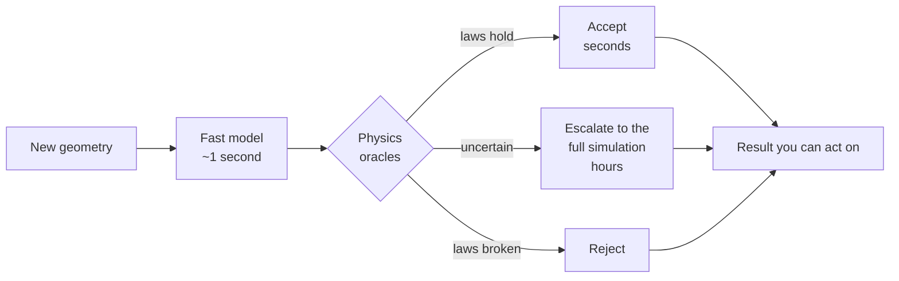

# We can make the simulation a thousand times faster. We still can't tell when it's wrong.

Simulating how blood moves inside a chamber of the heart is something computers
do well and slowly. Hours per case. There are now neural networks that learn to
imitate those simulations and answer in about a second, which sounds like the end
of the story.

It isn't, and the reason is uncomfortable: **when these models are wrong, they are
wrong with exactly the same confident face they wear when they are right.**

Every paper reports the average error over a test set. An average is a fine thing
to publish and a useless thing to act on. Nobody treats an average. You have one
geometry in front of you, one prediction, and no correct answer to compare it
against — because if you had the correct answer you wouldn't have needed the
model.

So the missing piece isn't a better model. It's a referee.

## Checking an answer without knowing the answer

Here is the part that makes this tractable. Physics imposes rules that can be
checked on the prediction alone.

Blood cannot appear or disappear: whatever flows in has to flow out. It cannot
slide frictionlessly along a wall; it has to come to rest against it. Energy has
to balance. None of these require knowing what the true answer was.

It's the same reason you can catch a doctored bank statement without knowing what
anyone actually bought. The transactions have to add up. If they don't, something
is wrong, and you learned that from the structure of the document rather than
from the truth behind it.

That's the whole idea: a set of independent physical checks — we call them
oracles — that read a prediction and score it, having never seen the right
answer.

## The product is the loop, not the model

What you are buying is not speed. It's **speed where it is safe, and accuracy
where it isn't**, with something other than optimism deciding which is which.

## The way this measurement lies to you

There's an obvious trap, and it's worth naming because it is easy to fall into
while producing beautiful numbers.

You can measure how well the referee separates good predictions from bad ones and
get an excellent score. You can separately measure that the fast model is a
thousand times faster than the simulation. Both true, and the system can still be
worthless — because if the referee is nervous and sends 80% of cases to the slow
simulation anyway, you saved nothing at all.

The two numbers only mean something multiplied together. So the metric this
project reports is a single coupled one: **how much compute is actually saved,
while holding mistakes below an agreed rate**, with the escalation fraction
printed right beside it. Reported together or not reported.

## Don't examine the student on the questions they studied

This is the part I find most interesting, and it generalises well past hearts.

The tempting move is to train the model to respect the physical laws — add the
law as a penalty in the loss function — and then use those same laws as the exam.
It feels rigorous. It is close to circular.

A model trained to minimise a residual will minimise that residual. It can push
that number down without the underlying field being right where it matters, and
the check is then satisfied by construction. **An exam on exactly what someone
studied stops measuring whether they learned.**

So the project writes a prediction down before running anything: the checks that
duplicate the training objective will be the *worst* at detecting that model's
failures, and the useful ones will be the checks the training never touched. If
that holds, it's a design rule for anyone building automated verification:

> A verifier that checks what the generator was optimised for is measuring the
> optimiser, not the generator.

And if it comes out the other way round, the mental model behind the whole design
is wrong and it needs rebuilding rather than extending. That's written down too.

## The first experiment costs an afternoon and can kill the project

There are classical flows whose exact solution has been known by formula for
about a century. Steady flow in a tube. Pulsating flow in a tube.

So the first experiment takes those exact answers, breaks them on purpose by
amounts we choose, and asks whether the referee's score tracks how badly they
were broken. If it can't rank errors we already know the size of, it will not
rank the ones we don't.

That's an afternoon of work, and it comes before the thousands of compute-hours
of simulation that the rest of the project would need. If it fails, the honest
result is "these checks are not sufficient", published with the same care as a
success, having spent an afternoon instead of a quarter.

I've come to think this is the part of research method that matters most and gets
written about least: not what you'd do if it works, but what the cheapest thing
is that would tell you it doesn't.

## What this is not

It is not diagnostic. It produces no risk score and no patient-level output of
any kind. It works with shapes and flow fields; cardiac geometry enters at the
end, as a test of whether the referee still functions outside the laboratory.

Everything rests on two public MIT-licensed sources: a fluid dynamics environment
suite for the fast, honest testbed, and a public cardiac CT dataset with
anatomical labels for the final transport test. The dataset provides geometry and
no flow at all, which means every reference solution has to be computed rather
than downloaded — a cost worth stating plainly rather than discovering later.

---

*Part of an open research project on agents whose work is checked by something
outside themselves. The specification, including the kill conditions written
before anything runs, lives beside this article.*

---

### Notes for publishing

LinkedIn does not render Mermaid. Export the diagram above as an image before
posting; the source stays here so the article and the repository cannot drift
apart. The Spanish mirror is `ARTICLE.es.md`.
